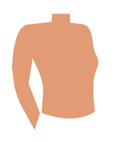

<!-- DollzMaker - A Modern Static HTML Doll Maker Site with Drag-and-Drop -->
<!DOCTYPE html>
<html lang="en">
<head>
    <meta charset="UTF-8">
    <meta name="viewport" content="width=device-width, initial-scale=1.0">
    <title>DollzMaker</title>
    <link rel="stylesheet" href="https://cdn.jsdelivr.net/npm/tailwindcss@2.2.19/dist/tailwind.min.css">
    
</head>
<body class="bg-gray-100 p-6">

    

        

            <h1 class="text-3xl font-bold mb-4">DollzMaker</h1>
            

                

                    <h2 class="font-bold mb-2">Your Doll</h2>
                    

                

                

                    <h2 class="font-bold">Drag & Drop Items</h2>
                    
                

            

        

    

    

</body>
</html>
